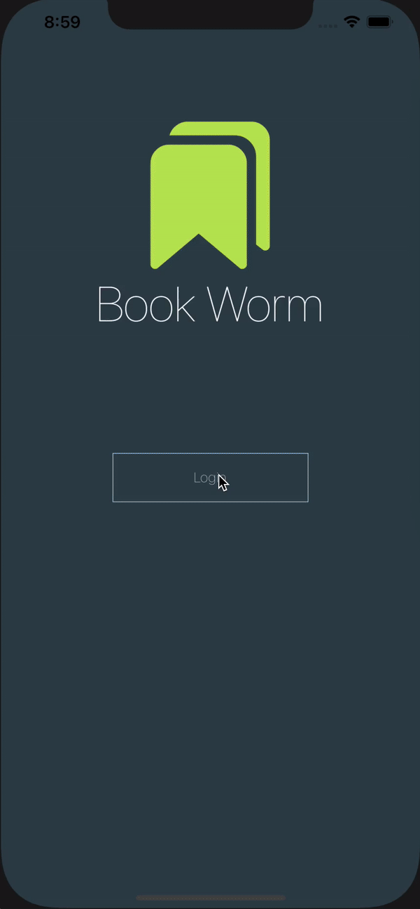

# Bookworm App
Bookworm app is built using React Native framework with Expo and Firebase to store books data. 

## What tools used for this project:
- [React-Native Expo](https://expo.io/)
- [Firebase](https://firebase.google.com/)
- [React Navigation](https://reactnavigation.org/docs/getting-started)
- [Redux](https://redux.js.org/introduction/getting-started)
- [Hooks](https://react-redux.js.org/api/hooks)

## Description
This app will be called Bookworm which the users can upload the book, read the book and mark it as read. This app have login screen which the user have to click to login with their email and password or sign up if they have not. After that, the users will be directed to home screen where they can manage the books. On the navigation bottom of the screen, there are three to navigate to screens; "Total Books", "Books Reading", and "Books Read". On the total book screen where the users can see the list of books or empty if they have not add the books. The user can add the book by typing the book name and click the button to add to the list. They can click the book and upload the image for book or use the camera to take the picture of book. The users can mark as read or remove the book. On the books reading screen, the list of books that are currently reading. On the books read screen, the list of books are done reading. 

## Demo
